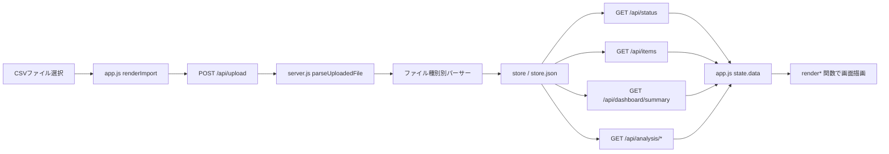

# システム全体概要

## 1. アプリケーションの目的

予実績管理ダッシュボードは、CSVで取り込んだ予算・見込み・実績データをローカル環境で可視化するダッシュボードです。README上は、統合レイアウトCSVをアップロードし、計画（plan）・見通し（forecast）・実績（actual）の3軸で予実績管理データを可視化するローカル専用アプリと説明されています。

## 2. ソース別の責務

| ソース | 主な責務 | 確認できる内容 |
|---|---|---|
| `public/index.html` | SPAの静的HTML骨格 | サイドバー、トップバー、グローバルフィルター、`#content`、Chart.js と CSS/JS の読み込み |
| `public/static/app.js` | フロントエンドSPA | ナビゲーション定義、状態管理、API呼び出し、画面描画、イベント処理、グラフ描画、表示倍率・テーマ制御 |
| `public/static/style.css` | UI/UXスタイル | ライト/ダーク/ネオンテーマ、カード、KPI、テーブル、レスポンシブ、focus-visible、reduced motion 対応 |
| `server.js` | Expressサーバ、CSV取込、正規化、集計API | CSV解析、ファイル種別ごとの取込、ローカル永続化、集計API、追加データAPI |
| `electron/main.js` / `electron/preload.js` | Electronシェル | ローカルExpress起動と安全なブラウザ環境提供。詳細仕様は本初期ドラフトでは限定的に扱う |

## 3. 画面構成の概要

| 区分 | 画面 |
|---|---|
| メインCSV | データ取込、全体サマリー、推移分析、カテゴリ別分析、アラート、ベンダー／契約更新、明細ドリルダウン |
| 追加CSV | 新規案件コスト、減価償却シミュレーション、OACIS実績 |
| 共通・ユーティリティ | 表示設定、使い方 |

画面キー、画面名、render関数、主なAPIは [02_screen-list.md](./02_screen-list.md) を参照してください。

## 4. CSV取込から画面表示までのデータフロー

## 5. 状態管理・ローカル保存

| 対象 | 実装上の保存先 | 概要 |
|---|---|---|
| 取込データ | `server.js` の `store`、既定では `~/.budget-csv-viewer/store.json` | 予実績データ、追加CSV、差額理由、施策、契約情報を保持 |
| フロントエンド状態 | `public/static/app.js` の `state` | 現在ページ、取得済みデータ、グローバルフィルター、UI設定を保持 |
| テーマ | `localStorage.theme` | ライト/ダーク/ネオンの選択を保持 |
| 表示倍率 | `localStorage.displayZoom` | 75〜150% の倍率を保持 |
| 金額単位 | `localStorage.moneyUnits` | 画面別に千円/百万円/億円を保持 |

## 6. 事実と補足

| 種別 | 内容 |
|---|---|
| コードから確認できる事実 | Express + Vanilla JS SPA + Chart.js + Electron 構成、CSVはメモリ受信、CSVパーサーは自前実装、取込済みデータはローカルJSONに保存される |
| 補足 | 本仕様書では、画面ラベルから読み取れる範囲で「予実績管理」「新規案件」「OACIS」などの業務名を使う |
| 未確認事項 | CSV列の正式な業務定義、金額単位の業務上の正式定義、部門運用ルール、OACIS元システムの仕様、会計期番号の正式根拠 |
