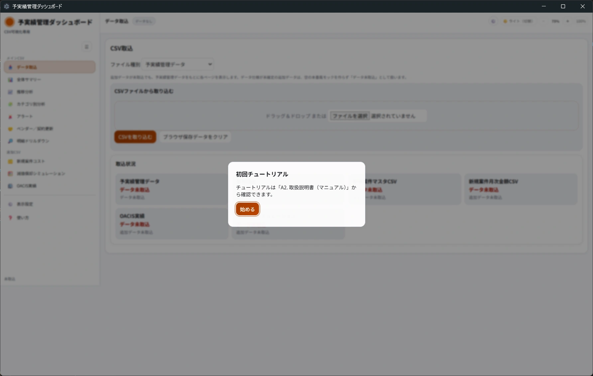
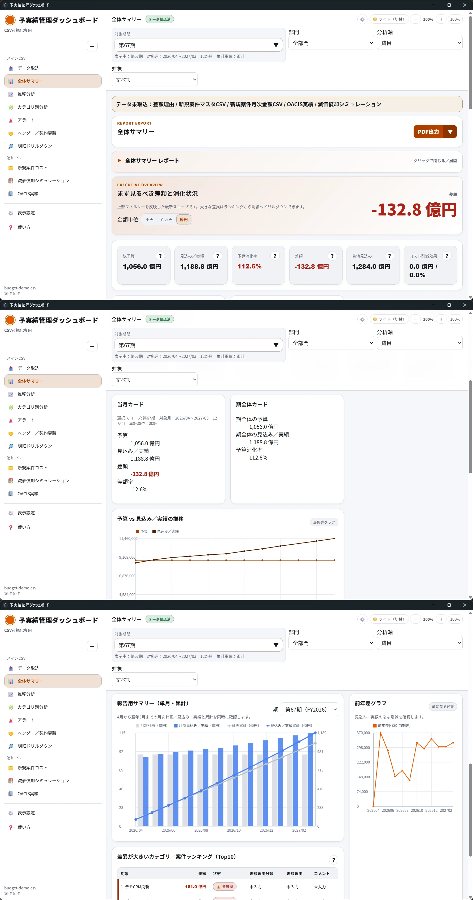

# はじめに

このページでは、初回起動後にCSVを取り込み、最初の確認画面を開くまでの流れを説明します。

## 1. アプリを起動します

1. 配布担当者から案内された方法でアプリを起動します。
2. 画面が開いたら、左側にメニュー、上部にページ名とデータ状態が表示されていることを確認します。
3. 初回チュートリアルが表示された場合は、内容を確認して「始める」をクリックします。

## 2. 初期画面を確認します

起動直後は「データ取込」画面が表示されます。まだ予実績管理データを取り込んでいない場合、画面上部の状態は「データなし」、サイドバー下部は「未取込」と表示されます。

「データ取込」画面では、次の項目を確認します。

| 項目 | 確認すること |
|---|---|
| ファイル種別 | 取り込むCSVの種類を選びます。 |
| ドラッグ＆ドロップ またはファイル選択 | CSVファイルを選びます。 |
| CSVを取り込む | CSV選択後にクリックできるようになります。 |
| ブラウザ保存データをクリア | 取り込み済みデータと画面設定を消すときに使います。通常は最初に押しません。 |
| 取込状況 | 予実績管理データと追加CSVの取込状態、件数、ファイル名を確認します。 |

## 3. 取り込むCSVを用意します

1. 配布されたCSVが手元にあることを確認します。
2. そのCSVが、選択する「ファイル種別」と一致していることを確認します。
3. ファイル名や保存場所が分かるようにしておきます。
4. ExcelファイルやJSONファイルは、現行画面では取込対象として確認できません。CSVを用意してください。
5. 文字化けが心配な場合は、CSVの保存形式を確認してください。先頭にBOMが付いたUTF-8 CSVは取り込み時に処理されますが、UTF-8以外の正式対応は要確認です。

デモ操作やスクリーンショット撮影では、リポジトリの `sample-data/demo/` にあるサンプルCSVを利用できます。サンプルCSVを使う場合は、次の対応表を目安に「ファイル種別」とファイル名を一致させてください。

| ファイル種別 | サンプルCSVファイル名 |
|---|---|
| 予実績管理データ | budget-demo.csv |
| 新規案件マスタCSV | new-project-master-demo.csv |
| 新規案件月次金額CSV | new-project-monthly-cost-demo.csv |
| OACIS実績 | oacis-actual-demo.csv |
| 減価償却シミュレーション | depreciation-simulation-demo.csv |

## 4. CSVを取り込みます

1. 「ファイル種別」を選択します。
2. CSVファイルをドロップゾーンへドラッグ＆ドロップします。ファイル選択欄から選んでもかまいません。
3. 予実績管理データの場合は、「読み込み結果サマリー（表示のみ）」と「エラーパネル（表示のみ）」が表示されます。
4. 追加CSVの場合は、選択したファイル種別に応じたプレビュー説明とエラーパネルが表示されます。
5. 内容を確認し、問題がなければ「CSVを取り込む」をクリックします。
6. 大きいファイルでは進捗が表示される場合があります。完了まで待ちます。
7. 取込後、画面上部が「データ読込済」になっていること、または対象の追加CSV画面へ自動遷移したことを確認します。

## 5. 最初に全体サマリーを確認します

1. 左メニューの「全体サマリー」をクリックします。
2. KPIカードが表示されることを確認します。
3. 予算、見込み／実績、予算消化率、差額などを確認します。
4. 気になる数値がある場合は、「アラート」または「明細ドリルダウン」で詳細を確認します。
5. 報告準備が必要な場合は、画面タイトル付近の「PDF出力」または「AI分析用プロンプト」を利用します。

## 6. 表示を見やすく調整します

1. 画面右上のテーマ切替ボタンをクリックすると、ライト/ダーク/ネオンを切り替えられます。
2. `−` をクリックすると表示倍率が5%下がります。
3. `＋` をクリックすると表示倍率が5%上がります。
4. `100%` をクリックすると表示倍率が標準に戻ります。
5. 「表示設定」画面でも、表示倍率とテーマを変更できます。
6. 対応画面では、金額単位を「千円」「百万円」「億円」から切り替えられます。

## 初回利用時の注意

- 最初は「予実績管理データ」を取り込むと、主要な分析画面を確認できます。
- 追加CSVを取り込まない場合、追加データが必要な画面では「データ未取込」と表示されることがあります。
- 減価償却シミュレーションとOACIS実績は、対象CSVを取り込んでいれば追加CSV単独でも画面を確認できます。
- 「ブラウザ保存データをクリア」は、取り込み済みデータと画面設定を消したいときだけ使用してください。
