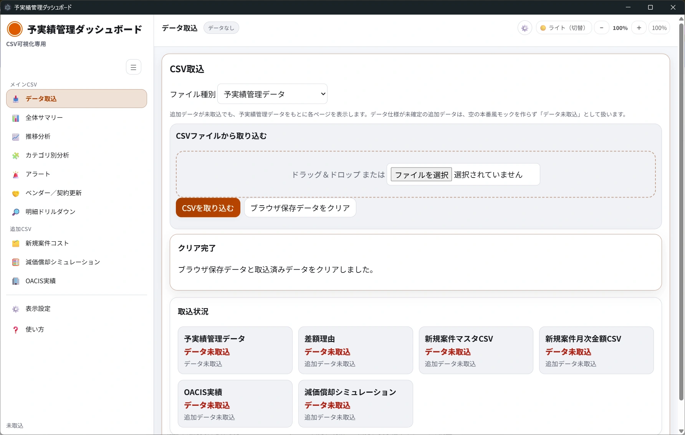

# 取込・出力ガイド

このページでは、CSV取込、取込時の確認、PDF/HTML/CSV出力の手順を説明します。

## 対応している取込形式

| ファイル形式 | 対応状況 |
|---|---|
| CSV | 取込できます。 |
| Excel | 現行画面では取込操作を確認できません。 |
| JSON | 現行画面では取込操作を確認できません。 |

CSVファイルの上限サイズは画面上には表示されません。大きいCSVを取り込むと、進捗表示が出る場合があります。

## 文字コード

- 画面上で文字コードを選択する操作は確認できません。
- UTF-8形式のCSV利用を推奨します。
- 先頭にBOMが付いたUTF-8 CSVは、取り込み時に処理されます。
- Shift_JISなど、UTF-8以外の文字コードでの正式対応は要確認です。

## 取込できるファイル種別

「データ取込」画面では、次のファイル種別を選択できます。

| ファイル種別 | 主な利用画面 |
|---|---|
| 予実績管理データ | 全体サマリー、推移分析、カテゴリ別分析、アラート、ベンダー／契約更新、明細ドリルダウン |
| 差額理由 | 差額理由に関する表示がある画面 |
| 新規案件マスタCSV | 新規案件コスト |
| 新規案件月次金額CSV | 新規案件コスト |
| OACIS実績 | OACIS実績 |
| 減価償却シミュレーション | 減価償却シミュレーション |

デモ操作やスクリーンショット撮影では、デモ担当者から配布されたサンプルCSVを利用できます。サンプルCSVを使う場合は、次の対応表を目安に「ファイル種別」とファイル名を一致させてください。

| ファイル種別 | サンプルCSVファイル名 |
|---|---|
| 予実績管理データ | budget-demo.csv |
| 新規案件マスタCSV | new-project-master-demo.csv |
| 新規案件月次金額CSV | new-project-monthly-cost-demo.csv |
| OACIS実績 | oacis-actual-demo.csv |
| 減価償却シミュレーション | depreciation-simulation-demo.csv |

## 必須項目について

CSVには、画面表示に必要な列が含まれている必要があります。利用者向けマニュアルでは詳細な列定義は扱いません。配布されたテンプレートまたは所定の形式に従ってください。

列が不足している、列名が異なる、数値が読み取れないなどの場合は、取込後にエラーや警告が表示されることがあります。

## CSVを取り込む手順

1. 左メニューの「データ取込」をクリックします。
2. 「ファイル種別」をクリックし、取り込むCSVの種類を選択します。
3. CSVファイルを「ドラッグ＆ドロップ」します。ファイル選択欄から選んでもかまいません。
4. 予実績管理データの場合は、「読み込み結果サマリー（表示のみ）」を確認します。
5. 「エラーパネル（表示のみ）」を確認します。
6. 問題がなければ「CSVを取り込む」をクリックします。
7. 取込が完了したら、画面上部が「データ読込済」になっていることを確認します。
8. 「取込状況」で対象のファイル種別が取込済みになっていることを確認します。

## 取込時の注意点

- ファイル種別とCSVの内容を一致させてください。
- Excelファイルをそのまま選択しても、現行画面ではCSVとして取り込めません。
- ファイルの列名や形式は、配布されたCSVの形式に合わせてください。
- 追加CSVが未取込でも、予実績管理データをもとに主要画面を表示できます。
- 追加CSVが必要な画面では、対象データがない場合に未取込の案内が表示されます。

## 取込エラー時の確認方法

1. 「エラーパネル（表示のみ）」の内容を確認します。
2. 選択した「ファイル種別」が正しいか確認します。
3. CSVの列名が所定の形式と一致しているか確認します。
4. 金額や年月などに、想定外の文字が入っていないか確認します。
5. 空のCSVや別の資料を選んでいないか確認します。
6. 解決しない場合は、表示されたメッセージ、ファイル種別、ファイル名、操作日時を控えて問い合わせてください。

## 出力できるファイル

| 出力 | 操作場所 | 保存される内容 |
|---|---|---|
| PDF出力 | レポート出力ツールバーがある画面 | 表示中のレポート画面 |
| HTMLとして保存 | レポート出力ツールバーがある画面 | 表示中のレポート画面をHTML化したもの |
| 表示結果をCSV書き出し | 明細ドリルダウン | 検索・表示列を反映した明細CSV |

PDF出力とHTML保存は、配布版アプリで利用できる想定です。ブラウザだけで開いている場合に利用できるかは未確認です。

## PDFを保存する手順

1. 出力したい画面を開きます。
2. 必要に応じてフィルター、金額単位、表示倍率を調整します。
3. 「PDF出力」をクリックします。
4. 保存先とファイル名を選択します。
5. 保存されたPDFを開き、内容を確認します。

## HTMLとして保存する手順

1. 出力したい画面を開きます。
2. 必要に応じてフィルター、金額単位、表示倍率を調整します。
3. 「HTMLとして保存」をクリックします。
4. 保存先とファイル名を選択します。
5. 保存されたHTMLを開き、内容を確認します。

## 明細CSVを書き出す手順

1. 「明細ドリルダウン」を開きます。
2. 検索欄にキーワードを入力します。
3. 必要な表示列にチェックを入れます。
4. 「表示結果をCSV書き出し」をクリックします。
5. `displayed_detail.csv` が保存されます。
6. 表計算ソフトなどで開き、必要に応じて集計や確認に利用します。

## 出力データを使うときの注意

- 出力前に、フィルター条件が意図した内容になっているか確認してください。
- 明細CSVは、画面に表示されている検索結果と表示列に基づきます。
- 出力ファイルに機密情報が含まれる場合があります。共有範囲や保存先は所属組織のルールに従ってください。
