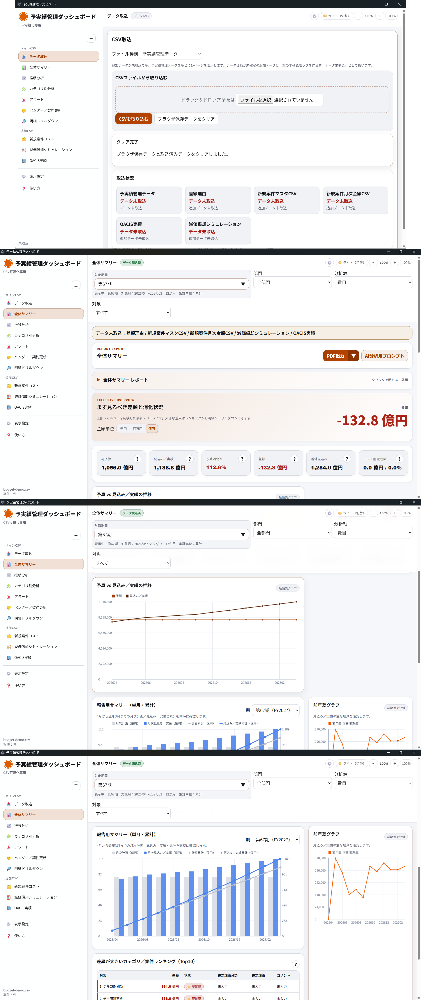

# 予実績管理ダッシュボード ユーザーマニュアル

このマニュアルは、予実績管理ダッシュボード（Budget CSV Viewer）を日常利用する方向けの操作ガイドです。CSVを取り込み、予算・見込み・実績を確認し、必要なレポートや明細を出力するまでの流れを説明します。

## このマニュアルの対象者

| 対象者 | このマニュアルで分かること |
|---|---|
| はじめてアプリを使う方 | 初回起動、CSV取込、最初に確認する画面 |
| 予実績データを確認する方 | 全体サマリー、推移、カテゴリ、アラート、ベンダー、明細の見方 |
| 追加CSVを確認する方 | 新規案件コスト、減価償却シミュレーション、OACIS実績の確認方法 |
| 報告や確認資料を作る方 | PDF/HTML出力、AI分析用プロンプト、明細CSV出力、表示調整 |
| 困ったときに自己確認したい方 | 取込エラー、表示崩れ、検索結果、出力失敗時の確認手順 |

このマニュアルでは、利用者が画面上で操作する内容を扱います。内部API、詳細なCSV列定義、開発者向け手順は、仕様書または管理者向け資料を参照してください。

## このアプリでできること

- CSVを取り込み、予算・見込み・実績の状況をローカル環境で確認できます。
- 全体KPI、月次推移、カテゴリ別内訳、アラート、ベンダー別状況を確認できます。
- 明細ドリルダウンで、管理番号・案件名・ベンダー名・部門名・担当者名などを検索できます。
- 新規案件、減価償却シミュレーション、OACIS実績など、追加CSVに応じた画面を確認できます。
- 主要ダッシュボード画面をPDFまたはHTMLとして保存できます（Electron配布版で利用）。
- 全体サマリーでは、表示条件に基づいたAI分析用プロンプトを生成し、Copilot等へ貼り付けるためにコピーまたは保存できます。
- 明細ドリルダウンの検索結果をCSVとして書き出せます。
- テーマ、表示倍率、金額単位、対象期間ショートカット、カテゴリ分類軸など、見やすさに関する表示を調整できます。

## 基本的な利用の流れ

1. アプリを起動します。
2. 「データ取込」画面を開きます。
3. 「ファイル種別」で取り込むCSVの種類を選択します。
4. CSVファイルを選択し、プレビューやエラーパネルを確認します。
5. 「CSVを取り込む」をクリックします。
6. 画面上部が「データ読込済」になったことを確認します。
7. 「全体サマリー」で全体の状況を確認します。
8. 必要に応じて「推移分析」「カテゴリ別分析」「アラート」「ベンダー／契約更新」「明細ドリルダウン」で詳しく確認します。
9. 追加CSVを取り込んでいる場合は「新規案件コスト」「減価償却シミュレーション」「OACIS実績」を確認します。
10. 必要な場合はPDF、HTML、AI分析用プロンプト、明細CSVとして出力します。

## 最初に読むページ

| 目的 | ページ |
|---|---|
| 初回起動からCSV取込までを知りたい | [はじめに](./getting-started.md) |
| 画面やボタンの意味を知りたい | [日常操作ガイド](./user-guide.md) |
| CSV取込や出力方法を知りたい | [取込・出力ガイド](./import-export.md) |

## 困ったときに見るページ

| 困りごと | ページ |
|---|---|
| よくある疑問を確認したい | [FAQ](./faq.md) |
| 起動、取込、表示、検索、出力で困っている | [トラブルシューティング](./troubleshooting.md) |

## このマニュアルの注意事項

- 画面名、ボタン名、メニュー名は現行画面の文言に合わせています。
- 現行画面から確認できない内容は「未確認」または「要確認」と記載しています。
- PDF/HTML出力はElectron配布版のデスクトップ機能を前提にしています。ブラウザだけで開いている場合は利用できません。
- 画面キャプチャは各ページの説明箇所に配置しています。
