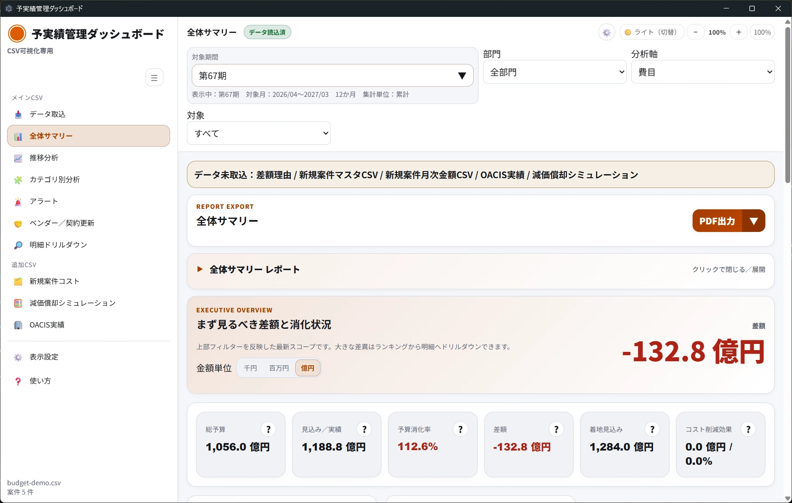
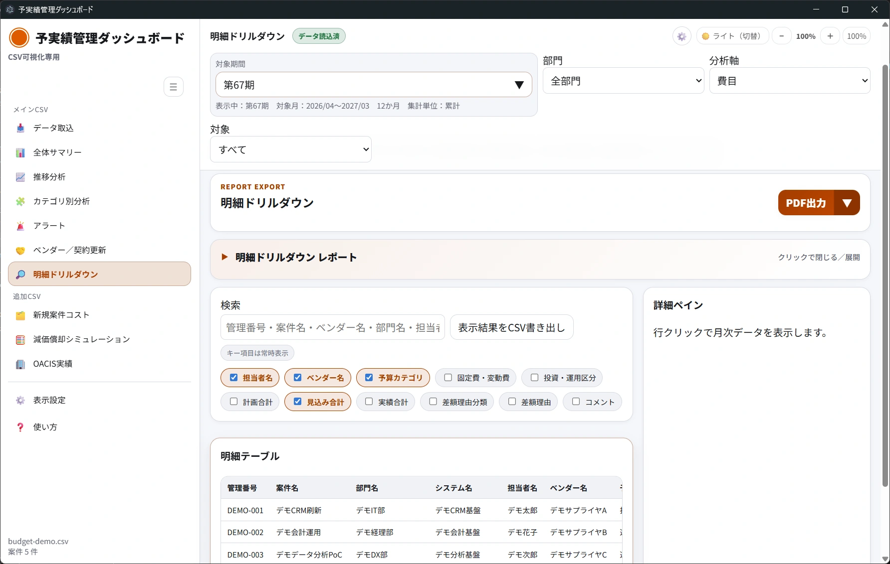

# 日常操作ガイド

このページでは、各画面の役割と日常的な操作手順を説明します。

## 画面全体の構成

| エリア | 役割 |
|---|---|
| 左メニュー | 画面を切り替えます。メインCSV、追加CSV、表示設定、使い方に分かれています。 |
| 上部バー | 現在のページ名、データ状態、テーマ切替、表示倍率を確認・操作します。 |
| グローバルフィルター | 対象期、対象月、部門、観点などを切り替えます。表示される画面で利用できます。 |
| メイン表示エリア | グラフ、KPI、ランキング、明細表などが表示されます。 |
| 出力ツールバー | 対応画面でPDF出力やHTML保存を行います。 |

## 左メニューの画面

| 区分 | 画面 | 使う場面 |
|---|---|---|
| メインCSV | データ取込 | CSVを取り込む、取込状態を確認する、保存データをクリアする |
| メインCSV | 全体サマリー | まず全体の予算・見込み・実績を確認する |
| メインCSV | 推移分析 | 月ごとの増減や傾向を確認する |
| メインCSV | カテゴリ別分析 | 分類軸を切り替え、費目、システム、部門、固定・変動、投資・運用、CSV追加分類などの観点で確認する |
| メインCSV | アラート | 差額や変動が大きい項目を優先して確認する |
| メインCSV | ベンダー／契約更新 | ベンダー別支出や契約更新候補を確認する |
| メインCSV | 明細ドリルダウン | 検索して根拠となる明細を確認する |
| 追加CSV | 新規案件コスト | 新規案件の費用状況を確認する |
| 追加CSV | 減価償却シミュレーション | 減価償却シミュレーションCSVを確認する |
| 追加CSV | OACIS実績 | OACIS実績CSVを確認する |
| 共通 | 表示設定 | しきい値、KPI並び順、対象期間ショートカット、カテゴリ別分析の初期値、分類軸管理、表示倍率、テーマを調整する |
| 共通 | 使い方 | アプリ内の簡易ガイドを確認する |

## 上部バーを操作します

### データ状態を確認します

1. 画面上部の状態表示を確認します。
2. 「データなし」と表示される場合は、まず「データ取込」でCSVを取り込みます。
3. 「データ読込済」と表示される場合は、各分析画面を確認できます。

### 表示倍率を変更します

1. `−` をクリックします。
2. 表示が5%ずつ小さくなります。
3. `＋` をクリックします。
4. 表示が5%ずつ大きくなります。
5. `100%` をクリックすると標準倍率に戻ります。

### テーマを切り替えます

1. 画面右上のテーマ切替ボタンをクリックします。
2. ライト、ダーク、ネオンの順に見た目が切り替わります。
3. 見やすいテーマで作業します。

## グローバルフィルターを使います

主要な分析画面では、上部にフィルターが表示されます。

| フィルター | 操作と結果 |
|---|---|
| 対象期間 | ポップオーバーから単月、当期通期、前期通期、直近期間、データ最新月、カスタム範囲を選択します。`当期通期` は現在日時が属する対象期の4月〜翌3月で、現在月までのYTDや四半期ではありません。 |
| 部門 | 「全部門」または特定部門を選択します。部門別に絞り込まれます。 |
| 観点 | 「費目」「システム」「固定・変動」「投資・運用」を選択します。分析の見方が変わります。 |
| 対象 | 「すべて」「継続案件」「新規案件」やベンダー別の対象を選択します。 |

フィルターを変更すると、表示中の画面が自動的に更新されます。対象期間ポップオーバーの「よく使う」は、表示設定から表示項目・順序・初期表示を変更できます。当月、前月、直近期間はブラウザの現在日時を基準に毎回再計算されます。データ最新月は取込データ内の最大年月であり、将来計画・見込みが含まれる場合は未来年月になることがあります。推移分析では、選択した対象期間を月別・四半期別・期別・累計推移で表示できます。

## 全体サマリーを確認します

1. 左メニューの「全体サマリー」をクリックします。
2. KPIカードで全体の状況を確認します。
3. 差額ランキングを確認します。
4. 気になる項目があれば、関連する行やリンクから明細確認に進みます。
5. 金額単位の切替が表示される場合は、「千円」「百万円」「億円」から見やすい単位を選択します。

## 推移分析を確認します

1. 左メニューの「推移分析」をクリックします。
2. 対象期や対象月を選択します。
3. グラフで増減の傾向を確認します。
4. 大きく増減している時期があれば、対象月で絞り込んで「明細ドリルダウン」を確認します。

## カテゴリ別分析を確認します

カテゴリ別分析では、予算・見込み・実績を「どの切り口で見るか」を分類軸として選び、分類値ごとの構成比、差額、乖離率を確認します。費用の偏りを見つけたいとき、説明が必要なカテゴリを絞り込みたいとき、会議前に深掘り対象を決めたいときに使います。

### 基本の確認手順

1. 左メニューの「カテゴリ別分析」をクリックします。
2. 画面上部の「分類軸」セレクトボックスで、確認したい切り口を選択します。
   - 例: システム分類名、経費区分、経費事象名、部門、固定費・変動費、投資・運用区分、予算カテゴリ、システム名。
   - CSVに `分類_XXX`、`分類＿XXX`、`dim_XXX`、`dimension_XXX` 形式の列が含まれている場合は、その列も分類軸として表示されます。
3. よく使う分類軸は、「よく使う」チップからワンクリックで切り替えます。
4. 「Top」で、分類別テーブルに表示する件数を 10 / 25 / 50 / 全件 から選びます。
5. 金額単位を「千円」「百万円」「億円」から選び、会議資料や画面確認に合う粒度にします。
6. 構成比グラフで、どの分類値が全体に占める割合が大きいかを確認します。
7. 分類別テーブルで、予算、見込み、実績、差額、乖離率、件数を確認します。
8. 気になる分類値をクリックすると、「明細ドリルダウン」に移動し、その分類軸・分類値だけに絞り込んだ明細を確認できます。

### 分類軸を選ぶときの見方

| 見たいこと | おすすめ分類軸 | 確認ポイント |
|---|---|---|
| システム領域ごとの費用偏り | システム分類名、システム名 | 基幹系・情報系など、特定領域に支出が集中していないか確認します。 |
| 費用の性質 | 経費区分、経費事象名、固定費・変動費 | 運用費、開発費、保守費など、費用の中身や固定費比率を確認します。 |
| 組織別の状況 | 部門 | 部門ごとの予算消化、差額、説明が必要な項目を確認します。 |
| 投資/運用の配分 | 投資・運用区分、予算カテゴリ | 投資案件と運用費のバランスを確認します。 |
| 自社独自の管理軸 | CSV追加分類列 | 事業優先度、クラウド分類、施策分類など、CSVで追加した分類軸を使って確認します。 |

### データ品質表示の見方

分類軸セレクタ付近には、選択中分類軸の状態が表示されます。

- `分類値数`: その分類軸に何種類の値があるかを示します。
- `未設定`: 分類値が空欄の明細件数です。未入力の分類値は「未設定」として集計されます。
- `最大分類の構成比`: 最も大きい分類値が全体に占める割合です。

分類値数が多い場合は、粒度が細かすぎて全体傾向を読み取りにくいことがあります。30種類を超える場合はTop Nで上位を確認し、100種類を超える場合は明細検索や別の分類軸での確認も検討してください。

### CSVで追加した分類軸を使う場合

予実績管理CSVに次のような列を追加すると、取込時にカテゴリ別分析の分類軸として自動検出されます。

- `分類_事業優先度`
- `分類_クラウド分類`
- `分類_施策分類`
- `dim_project_type`
- `dimension_management_type`

取込プレビューに「追加分類列を検出しました」と表示された場合、その分類軸はカテゴリ別分析の分類軸セレクタと表示設定の「分類軸管理」に表示されます。CSV列の値が空欄の場合は「未設定」として集計されます。

### 明細へ進むときの注意

カテゴリ別分析から明細へ進む場合、選択した分類軸と分類値の組み合わせで絞り込まれます。たとえば「システム分類名: 基幹系」をクリックした場合、他の列に同じ文字列があっても、システム分類名が「基幹系」の明細だけが対象になります。絞り込みを解除したい場合は、明細ドリルダウン画面の「絞り込み解除」をクリックします。

## アラートを確認します

1. 左メニューの「アラート」をクリックします。
2. しきい値を超えた項目や、変動が大きい項目を確認します。
3. 対象行から明細確認へ進める場合は、明細で根拠を確認します。
4. しきい値を変更したい場合は「表示設定」を開きます。

## 明細ドリルダウンを使います

1. 左メニューの「明細ドリルダウン」をクリックします。
2. 「検索」欄に管理番号、案件名、ベンダー名、部門名、担当者名などを入力します。
3. 入力内容に一致する明細が表示されます。
4. 表示したい列にチェックを入れます。
5. 行をクリックします。
6. 右側または下部の詳細ペインに月次データが表示されます。
7. 検索結果を保存したい場合は、「表示結果をCSV書き出し」をクリックします。
8. 他画面からの絞り込みが残っている場合は、「絞り込み解除」をクリックします。

## 表示設定を変更します

表示設定では、アラート検出のしきい値、対象期間ショートカット、カテゴリ別分析の初期表示、分類軸管理、表示倍率、テーマを調整できます。設定の多くは利用中のブラウザの localStorage に保存され、次回読み込み時も維持されます。

### 基本設定を変更します

1. 左メニューまたは画面右上の設定ボタンから「表示設定」を開きます。
2. 「乖離率%」「差額金額」「前月比%」「前年比%」を必要に応じて入力します。
3. 「重要KPI 並び順（カンマ区切り）」を必要に応じて編集します。
4. 対象期間ショートカットで「よく使う」に表示する項目、表示順、初期表示を変更します。必要に応じて現在の対象期間をユーザー定義ショートカットとして追加します。
5. 「カテゴリ別分析」セクションで、カテゴリ別分析を開いたときの初期分類軸とTop N初期値を選択します。
6. 表示倍率をスライダーまたは数値入力で変更します。
7. 表示テーマを選択します。
8. 「反映」、ショートカットの「保存」、またはカテゴリ別分析設定の「保存」をクリックします。

### 分類軸管理を変更します

「分類軸管理」では、カテゴリ別分析に表示する分類軸を管理できます。固定分類軸だけでなく、CSVから自動検出された分類軸も管理対象です。

| 項目 | 操作できること |
|---|---|
| 表示順 | 数値入力、または「上へ」「下へ」でカテゴリ別分析の分類軸セレクタに出る順番を変更します。 |
| 表示名 | セレクタ、よく使うチップ、見出し、明細ドリルダウン条件に表示される名前を変更します。空欄にした場合は元の名称に戻ります。 |
| 分類軸ID | システム内部の識別子です。通常は編集せず、問い合わせ時の確認情報として使います。 |
| CSV列 | CSV検出分類軸の場合、元になったCSV列名を確認できます。固定分類軸は `-` と表示されます。 |
| 種別 | 標準で用意された軸は「固定」、CSVから追加された軸は「CSV検出: 列名」と表示されます。 |
| 表示 | OFFにすると、カテゴリ別分析の分類軸セレクタに表示されなくなります。全分類軸をOFFにすることはできません。 |
| よく使う | ONにすると、カテゴリ別分析の「よく使う」チップに表示されます。よく切り替える軸だけONにすると画面が見やすくなります。 |
| データ品質 | 分類値数、未設定件数、最大分類の構成比を確認できます。分類値数が多い場合は警告バッジが表示されます。 |
| 操作 | 「初期化」でその分類軸だけ設定を戻します。「分類軸設定を初期化」で全分類軸設定を戻します。 |

### 分類軸管理の利用例

- 「システム分類名」を一時的に非表示にし、部門別・費用区分別の確認に集中する。
- 「経費区分」の表示名を、社内で使っている「費用区分」に変更する。
- 「部門」をよく使うチップから外し、代わりにCSV検出の「事業優先度」をよく使うチップに追加する。
- 「固定費・変動費」や「クラウド分類」の表示順を上げ、カテゴリ別分析で選びやすくする。
- CSV検出分類軸の元CSV列名を確認し、どの列から追加された分類軸なのか確認する。

### 初期化するとき

分類軸管理で「分類軸設定を初期化」をクリックすると、分類軸ごとの表示名、表示/非表示、よく使う、表示順が初期状態に戻ります。固定分類軸は標準定義に戻り、CSV検出分類軸は現在取り込まれているCSVから再検出された状態に戻ります。カテゴリ別分析の初期分類軸は「システム分類名」に戻ります。

分類軸設定を初期化しても、取り込み済みCSVデータ自体は削除されません。取り込み済みデータも含めて消したい場合は、「データ取込」画面の「ブラウザ保存データをクリア」を使います。

## 保存・編集・削除について

### 保存される内容

- CSV取込後のデータは、アプリ側に保存されます。
- テーマ、表示倍率、金額単位、対象期間ショートカット、カテゴリ別分析の初期表示、分類軸管理など、一部の表示設定も保存されます。
- 保存場所や保存期間の詳細は、利用者画面からは確認できません。要確認です。

### 編集できる内容

- 表示設定、表示倍率、テーマ、金額単位、明細の表示列、カテゴリ別分析の分類軸表示設定は画面上で変更できます。
- 取り込んだ元CSVの内容を画面上で直接編集する操作は確認できません。

### 削除・クリアする操作

1. 「データ取込」を開きます。
2. 「ブラウザ保存データをクリア」をクリックします。
3. 確認メッセージが表示された場合は、内容を確認します。
4. 実行すると取り込み済みデータがクリアされます。必要な出力が終わってから実行してください。

